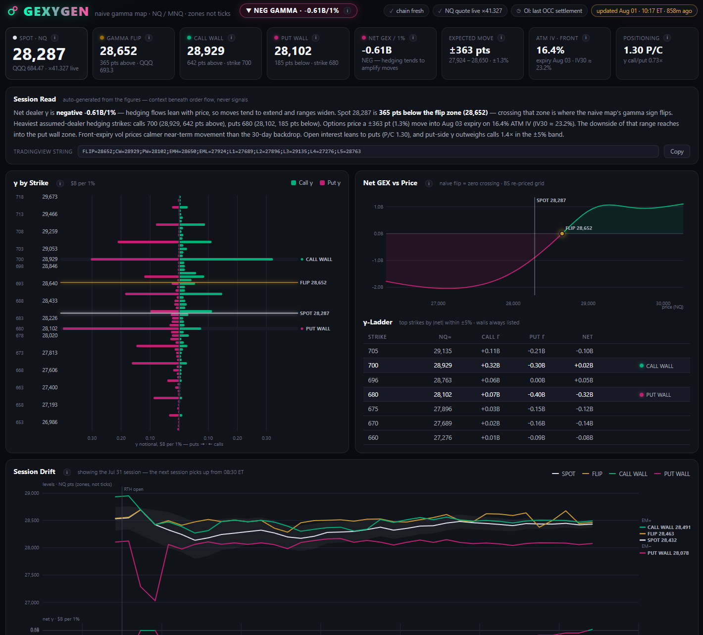
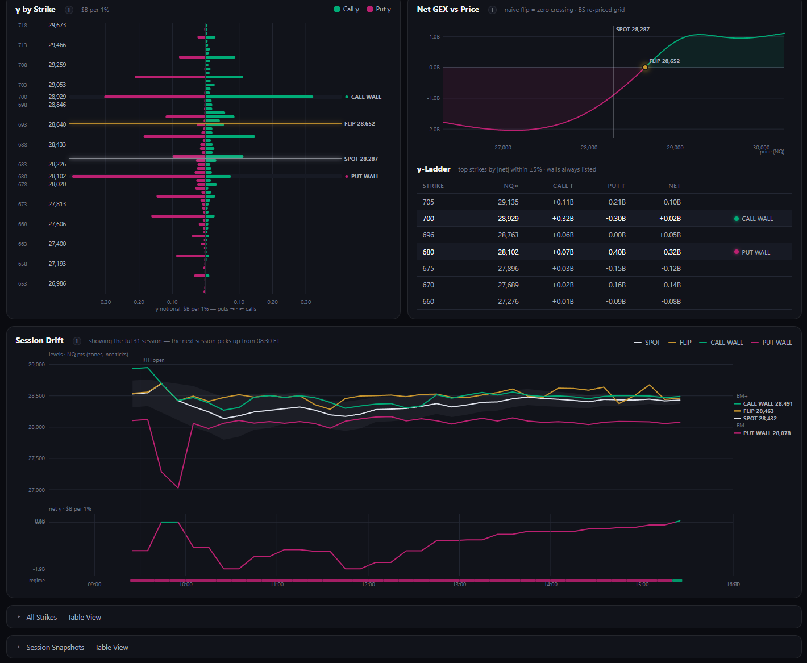

# NQGEX

**Self-hosted gamma exposure (GEX) levels for NQ / MNQ futures — computed from free public data, on your own machine, for $0/month.**

> **Status:** currently built for **local use** — the collector and dashboard run on your own PC. Hosting it as an accessible web app is on the roadmap; the architecture (a stateless viewer over a single data payload) was designed with that migration in mind.



## What it is

NQGEX is a personal, self-hosted alternative to commercial options-positioning dashboards (SpotGamma, MenthorQ, GEX Radar) for the slice of their value that can be computed from **published open interest and delayed quotes**: dealer gamma exposure levels, translated into NQ futures points.

Every 5 minutes during the US session it ingests the full QQQ options chain from Cboe's delayed public feed and a live NQ futures quote, runs a gamma exposure model over ~12,000 contracts, and produces:

| Output | What it tells you |
|---|---|
| **Net GEX & regime** | Total dealer gamma per 1% move. Positive → hedging flows tend to dampen moves; negative → hedging flows tend to amplify them |
| **Gamma flip** | The price where the net gamma of the map changes sign, found by re-pricing the whole book across a ±7% grid |
| **Call wall / Put wall** | The strikes carrying the heaviest call-side / put-side gamma — where opposing hedge flow is thickest |
| **Secondary walls (▲ZG / ▼ZG)** | The notable *opposite-side* concentrations across the zero-gamma level: put gamma sitting above the flip, call gamma sitting below it. Listed only when they carry ≥25% of their own side's primary wall and sit clear of every level already on the chart |
| **γ-Ladder** | The runner-up strikes by absolute net gamma — the secondary shelves of the map, each tagged with the side whose gamma dominates that strike |
| **γ-Spikes** | Strikes carrying heavy gamma on *both* sides at once. Because the ladder ranks by *net* gamma, a strike whose calls and puts cancel scores ~zero however large its bar — these are selected on total gamma instead, closing that blind spot, and join the ladder as ordinary levels |
| **Expected move (EM±)** | The options market's ~1σ price range into the front expiry, from ATM implied volatility |
| **ATM IV & IV30** | Front-expiry at-the-money vol (the EM input) and a 30-day interpolated vol for comparison against composite IV numbers |
| **Positioning** | Put/call open interest ratio and call/put gamma ratio in the near band |

All levels are computed in QQQ option space and translated to NQ points through a **live-derived futures/ETF multiplier** (never hardcoded — it drifts with basis, so it is recomputed every run). MNQ is identical in price.

## The dashboard

A single self-contained dark-theme HTML page, regenerated by the collector on every snapshot and self-refreshing in the browser — no server required.



- **Session Read** — an auto-generated plain-English synthesis of the current map: regime, spot vs flip, walls with distances, the priced range vs the walls, vol term structure, and positioning
- **γ by Strike** — the full per-strike gamma histogram (calls vs puts) with walls, spot, and flip overlaid
- **Net GEX vs Price** — the re-priced gamma curve whose zero crossing is the flip
- **Session Drift** — how flip, walls, spot, the EM band, and net gamma have moved through the session (07:00–16:00 ET), with a per-snapshot regime strip. Outside market hours the most recent session stays on display
- **γ-Ladder & table views** — full anatomy of every strike, paginated
- **ⓘ explainers everywhere** — every metric, chart, and status chip carries a plain-English explanation of what it is and how it's computed
- **A visible data ledger** — chips showing exactly where this snapshot's data came from (chain fresh/cached/stale, quote live/failed, OI vintage) and how old the snapshot is. Fetch failures are surfaced, never silent

## Chart integrations

Both platforms get the same levels, the same colours and the same labels. They differ only in how the data reaches them — which is decided entirely by what each platform's scripting language is allowed to do.

| | NinjaTrader 8 | TradingView |
|---|---|---|
| File | `GexLevels.cs` | `gexygen_levels.pine` |
| Delivery | **Automatic** — reads `levels.txt` from disk | Paste string |
| Updates | Every 30 s, unattended | When you paste |
| Why | NinjaScript is C# with file access | Pine is sandboxed: no network, no disk |

### NinjaTrader 8 — automatic

`GexLevels.cs` reads the collector's `levels.txt` straight off disk, so the levels keep themselves current with no interaction at all:

```
Cboe options chain  →  collector.py  →  levels.txt  →  GEX Levels  →  chart
                        every 5 min                     every 30 s
```

A timer compares the file's modified time against what it last read and does nothing if unchanged — a 337-byte file and a stat call, about **0.0005% of one CPU core**. When the collector rewrites the file, the indicator re-parses and repaints within 30 seconds.

Worth being clear about: **the levels do not come from NinjaTrader's datafeed.** NT8 supplies only the price bars and the price scale; every level is computed from Cboe options data by the Python collector. The indicator would keep drawing levels with the datafeed disconnected.

Zones, lines and labels are painted in a single owned render pass, so each line terminates where its label begins instead of striking through it. A bottom-right status line shows the age of `levels.txt` and turns amber when the feed stalls — NT8 has no status chips of its own, and a stale feed should never be silent. It will go amber overnight by design, once the collector exits at 16:05 ET.

Install: copy `GexLevels.cs` into `Documents\NinjaTrader 8\bin\Custom\Indicators\`, press **F5** in the NinjaScript Editor, then add **GEX Levels** to an NQ/MNQ chart and point the `levels.txt` path input at your collector directory.

### TradingView — paste string

Pine Script is sandboxed (no network or file access), so NQGEX uses the same delivery mechanism the commercial vendors use on TradingView: a **paste string**. The collector writes a one-line levels string to `tv_levels.txt` and displays it on the dashboard with a copy button; the included **GEX Levels** indicator (`gexygen_levels.pine`) parses it and draws the levels with zone shading, configurable styling, and per-level colors.

```
FLIP=28478;CW=28882;PW=28057;PWA=29088;EMH=28565;EML=28329;L1P=27851;L5C=28676
```

`FLIP` zero gamma · `CW`/`PW` primary call/put walls · `PWA` put wall above zero gamma · `CWB` call wall below zero gamma · `EMH`/`EML` expected-move edges · `L<n>C` / `L<n>P` ladder levels, where the suffix is the side whose gamma dominates that strike — so the chart labels read `L1 PUT 27,851` rather than an anonymous price. Older strings with bare `L<n>` keys still parse.

## How it works

```
Cboe delayed options chain (QQQ)  ──┐
                                    ├──►  collector.py  ──►  SQLite archive (per-strike map,
CNBC futures quote (@ND.1)  ────────┘         │              gamma curve, session history)
                                              │
                                              ├──►  dashboard.html   (the app)
                                              ├──►  levels.json      (machine-readable snapshot)
                                              ├──►  levels.txt   ──►  NinjaTrader 8 (auto, every 30 s)
                                              └──►  tv_levels.txt ──► TradingView (paste string)
```

- **One data source of truth** — everything is computed locally from Cboe's published chain (plus one futures quote for translation). No API keys, no subscriptions, no third-party GEX feeds
- **Self-checking** — the engine computes gamma two independent ways (chain-supplied greeks vs Black-Scholes re-pricing) and flags any sign disagreement; a stale-cache fallback and status ledger make every failure visible
- **Polite by design** — every fetch is a conditional `If-None-Match` request, so an unchanged chain costs a 304 and zero bytes instead of 5.5 MB. Polling frequency and bandwidth are decoupled
- **Honest about age** — the dashboard headlines the age of the *data* (Cboe's own payload timestamp plus their ~15-minute source delay), not the age of the last run. "Computed 1 minute ago" is true and useless when the chain underneath is half an hour old

## Running it

Requirements: Python 3.9+ (Windows: the `py` launcher) and the `tzdata` package (`pip install tzdata` — needed for IANA timezones on Windows).

```
py collector.py                  # one snapshot
py collector.py --loop 5         # snapshot every 5 minutes (chain TTL follows the interval)
start_collector.cmd              # full session: waits for 07:00 ET, runs to the close, logs
launch_gexygen.cmd               # one click: opens the dashboard + starts the session collector
```

The session window is gated in **ET via zoneinfo** (premarket from 07:00, capturing the fresh overnight open interest that lands ~09:00, through the 16:00 close marks), so DST never needs schedule changes. A Windows Task Scheduler entry pointed at `start_collector.cmd` makes the whole thing hands-off; a single-instance guard makes double-launches safe.

## Honesty & limitations (by design)

- The model assumes the **textbook dealer position** (long calls / short puts) — the same assumption every free GEX source runs on. It is **not** dealer-calibrated positioning
- Translated levels are **zones (±~20 NQ pts), never ticks** — one QQQ strike spans ~41 NQ points
- Chain data is ~15 minutes delayed; **open interest is frozen intraday** (it updates overnight via OCC settlement), so the map cannot see positioning built today
- NQGEX provides **levels and context, not trade signals** — it is designed as a context layer beneath an order-flow-driven process, and its UI copy is deliberately written to never suggest otherwise

## Roadmap

- Hosted deployment (live shared dashboard)
- `_NDX` / `_SPX` chains alongside QQQ
- Long-horizon analytics from the SQLite archive: flip/wall stability, regime persistence, realized-vs-expected move by regime

## Disclaimer

Personal project, personal use. Nothing here is financial advice, and no output constitutes a trade signal. Market data is sourced from free public delayed endpoints; redistributing market data commercially requires exchange licensing.
